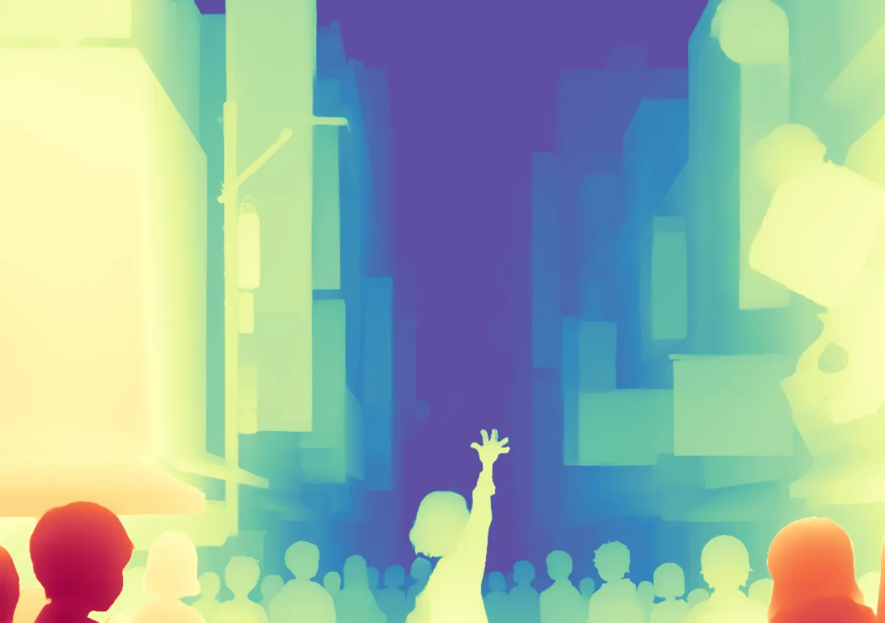
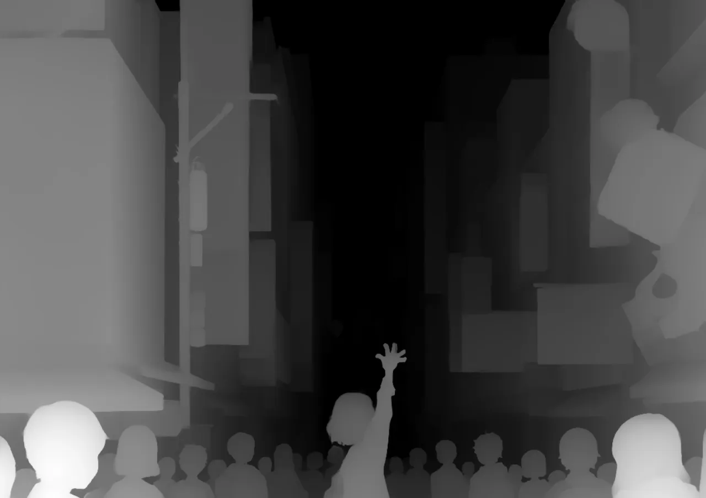

# 🌌 3D Pixel Particle Reconstruction (Vue 3 + Three.js)

[English](./README_EN.md) | [中文](./README.md)

一个基于 **Vue 3** 和 **Three.js** 的高性能 WebGL 粒子特效实验项目。该项目能够将普通的 RGB 图像转化为数万个 3D 粒子，并支持通过 **深度图 (Depth Map)** 重构 2.5D/3D 浮雕模型，以此模拟点云扫描效果。

<div style="
    width: 600px;
    height: 400px;
    display: grid;
    grid-template-columns: 1fr 1fr;
    grid-template-rows: 1fr 1fr;
    gap: 8px;
    background: #a29d9d40;
    text-align: center
    padding: 8px;
    border-radius: 12px;">
    <div style="overflow: hidden; border-radius: 8px;">
        
    </div>
    <div style="overflow: hidden; border-radius: 8px;">
        
    </div>
    <div style="overflow: hidden; border-radius: 8px;">
        
    </div>
    <div style="overflow: hidden; border-radius: 8px;">
        
    </div>
</div>

----

<div style="
    display: flex;
    align-items: center;
    gap: 10px;
    margin: 12px 0;
    font-family: -apple-system, BlinkMacSystemFont, 'Segoe UI', sans-serif;
">  
    <a style="
        font-size: 18px;
        font-weight: 600;
        color: #58373e;
        text-decoration: none;
    ">
    示例图作者: 
    </a>
    
    <a href="https://www.nemupan.com" target="_blank" style="
        font-size: 18px;
        font-weight: 600;
        color: #f2a3b3;
        text-decoration: none;
    ">
        nemupan
    </a>
</div>


## ✨ 核心特点

* **🖼️ 图像粒子化**：支持上传任意 RGB 图片（JPG/PNG）生成像素粒子矩阵
* **🧊 深度重构 (Depth Reconstruction)**：支持上传单通道深度图（Depth Map），基于其灰度值将 2D 图像实时转化为 3D 点云模型。
* **🎞️ GIF 动图支持**：内置 GIF 解析器，支持上传 GIF 动图，粒子会随每一帧动画实时更新颜色。


## 🛠️ 项目环境

* **Frontend Framework**: Vue 3 (Composition API)
* **3D Engine**: Three.js
* **Build Tool**: Vite
* **Shader Language**: GLSL (Vertex & Fragment Shaders)
* **Utils**: gifuct-js (GIF parsing)

## 🚀 快速开始

### 1. 环境要求

* Node.js > 22.0
* npm 或 yarn

### 2. 安装依赖

```bash
git clone 
cd pixel-particles
npm install
```

### 3. 启动开发服务器

```bash
npm run dev
```

访问 `http://localhost:5173`即可

--------

## 📖 使用指南

### 基础操作

1. **上传图片**：点击 UI 面板上的 **`UPLOAD IMAGE`** 按钮，选择一张普通的彩色图片。
2. **视角控制**：
    * **左键拖拽**：旋转模型。
    * **右键拖拽**：平移视角。
    * **滚轮滚动**：缩放视图。


### 3D 深度模式

要使用“深度点云”效果，你需要：一张原图，一张对应的深度图。

1. 先上传 **RGB 原图**。
2. 点击 **`UPLOAD DEPTH`** 按钮上传深度图（必须是单通道深度图）。

3. 上传成功后，UI 会显示 `3D MODE`，粒子将自动根据深度隆起。

### 特效控制

* 点击 **`EXPLODE PARTICLES`**：粒子会基于噪声算法炸开/松散。
* 点击 **`ASSEMBLE PARTICLES`**：粒子还原为紧致的图像/模型状态。

## 🧩 项目结构

```
src/
├── assets/             # 静态资源 (默认演示图)
├── components/
│   ├── PixelImage.vue  # [核心] 主场景组件 (Three.js 逻辑, Shader, UI)
│   └── PresetSelector.vue # 预设图片选择器组件
├── utils/
│   └── gifLoader.js    # GIF 解析与帧处理工具
├── App.vue             # 根组件
└── main.js             # 入口文件

```

## 🧠 核心原理 (Shader 解析)

项目的核心在于自定义的 **Vertex Shader (顶点着色器)**；不是移动 Mesh 本身，而是移动了数万个顶点的坐标。

```glsl
// 伪代码逻辑
void main() {
    // 1. 计算基础坐标 (x, y)
    float x = offset.x - width * 0.5;
    float y = height * 0.5 - offset.y;
    
    float z = 0.0;

    // 2. 判断是否有深度图
    if (uHasDepth > 0.5) {
        // 读取深度图灰度值 (r通道)
        float depthVal = texture2D(uDepthTexture, vuv).r;
        // 映射 Z 轴：黑色(0) -> 凸起, 白色(1) -> 凹陷
        z = (1.0 - depthVal) * uDepthScale;
    } else {
        // 3. 无深度图时，应用 Simplex Noise 噪点爆炸
        float noise = snoise(offset + uTime);
        z = noise * uThick;
    }

    // 4. 输出最终位置
    gl_Position = projectionMatrix * modelViewMatrix * vec4(x, y, z, 1.0);
}

```

## 🤝 贡献与反馈

如果你有更好的 Shader 算法或优化建议，欢迎提交 `Issue` 或 `PR` ！

## 📄 License

> [!CAUTION]
>
> 本项目基于 MIT License © 2026 Dimon0000000

